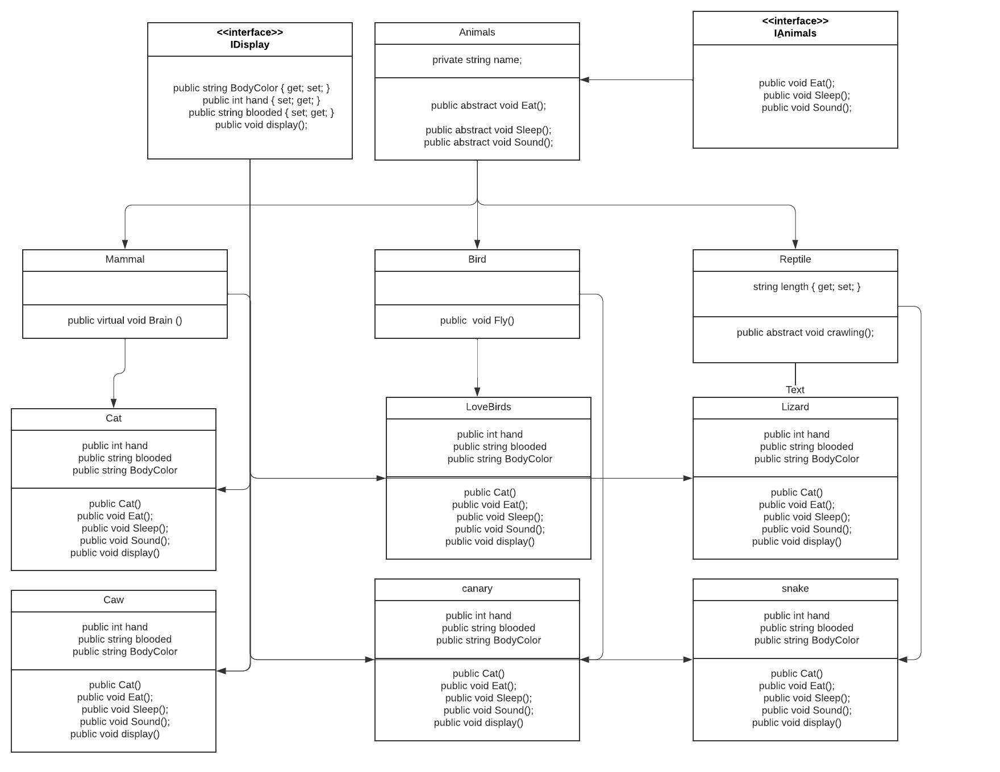

# Lab-06-I-built-a-Zoo

## Class Diagram

##
## OOP 
The basic principles of OOP involves Abstraction, Encapsulation, Inheritance, and Polymorphism. There are also objects and classes. Together, they stand as the working principle of any object-oriented programming language.
1. Inheritance
- Inheritance enables you to create new classes that reuse, extend, and modify the behavior defined in other classes.
- Inheritance is a mechanisim in which one object acquires all the props and behaviors of a parent object.
- Conceptually, a derived classes is a specialization of the base class.
-  Inheritance represent the IS-A relationship.
2. Encapsulation
- In object-oriented programming, encapsulation refers to the bundling of data with the methods that operate on that data, or the estricting of direct access to some of an object's components.
3. Polymorphism
- Polymorphism is a mechanism to perform single action in different ways.
- Polymorphism is a Greek word that means "many-shaped" and it has two distinct aspects:
     1. Compile-time (Overloading).
    2. Run-time (Overriding).
4. Abstraction
- Two ways to achive abstraction:
- The abstract keyword enables you to create classes and class members that are incomplete and must be implemented in a derived - class.
- It can have abstract and Non-abstract methods.
- It can not be instantiated, so it need to be extended.
## Run a code 

